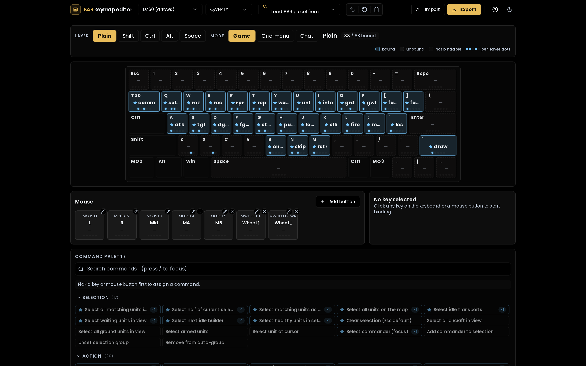
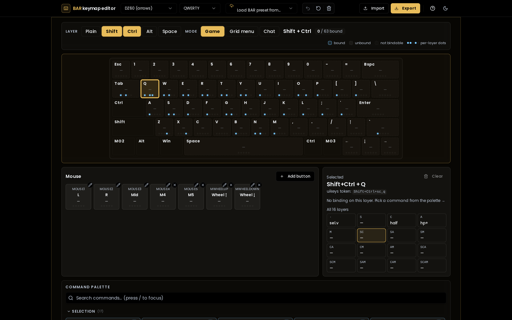

# BAR keymap editor

Visual editor for [Beyond All Reason](https://www.beyondallreason.info/)'s
`uikeys.txt` config. Open the page, see your keyboard with BAR's grid bindings
already drawn on it, remap visually, export the file. No text editor required.

> **Live demo:** _enable GitHub Pages on your fork — see [Deploying to GitHub Pages](#deploying-to-github-pages) below._



Switching to the Ctrl layer with Q selected — the panel shows the binding's
full command, and the layer pills reveal what's on every other modifier
combination:



## What it does

- **Renders your physical keyboard** — 11 built-in form factors: DZ60 (with
  arrows), ANSI / ISO 60%, 65%, 75%, TKL, and full-size. Optional cosmetic
  label switch between QWERTY / QWERTZ / AZERTY / Dvorak / Colemak (BAR binds
  by scancode, so layout choice is purely visual). Custom layouts via
  paste-JSON or upload.
- **16-layer system** — every chord of Shift / Ctrl / Alt / Meta is a separate
  layer. (`Meta` is BAR's "Space" modifier; the UI shows it as `Space` for
  clarity.) Per-key dot indicators show at a glance which layers have
  bindings.
- **Three view modes** — `main` (regular game commands), `gridmenu` (BAR's
  build menu, fires when a builder is selected), `chat` (chat-input
  bindings). Each filters both the keyboard view and the command palette to
  the commands that actually fire in that context.
- **Mouse buttons** — bind L / R / Mid plus up to 7 extra side buttons and
  scroll up/down, all cross-layer.
- **Command palette** — ~140 BAR commands across Selection / Action / Builder
  / State / Game / Camera / Build / Custom, with search, tooltips, and
  visual highlighting of essential defaults (auto-fetched from BAR's repo).
- **Custom commands** — quick-text input for raw uikeys syntax, plus a
  recipe-driven 3-step visual builder for `select` queries (source → filters
  → action) with live preview.
- **Import** — paste a `uikeys.txt`, upload a file, or pull any of 7 stock
  BAR presets (grid, grid-60%, num, chat-and-UI, etc.) directly from BAR's
  master branch. Replace or merge.
- **Export** — generates a clean `uikeys.txt`, copy or download.
- **Persistence** — every change saves to localStorage; first load shows BAR
  defaults so beginners are never staring at a blank keyboard.
- **Undo** (Ctrl+Z), keyboard shortcuts (`/` to search, `Esc` to clear
  selection, Ctrl+E to export), arrow-key navigation between adjacent keys,
  dark/light/system colour scheme.

## The layer system, for newcomers

BAR's `uikeys.txt` lets you bind a different command to each combination of
modifier held with a key. `Q` alone is one binding; `Shift+Q`, `Ctrl+Q`,
`Alt+Q`, `Meta+Q` (Space+Q in BAR's docs) are four more — and then every
multi-modifier chord up through `Shift+Ctrl+Alt+Meta+Q`. That's 16 bindings
per physical key.

In the editor, the four modifier toggles in the top bar select which of those
sixteen layers you're editing. The **dot row underneath each key** lights up
once for every layer that has a binding, so you always know what's hidden
behind a chord. The **layer pills in the right-side info panel** show every
binding for the selected key in one glance — click any pill to switch layers
without losing your selection.

## Install & run locally

Requires Node 22+ and pnpm 9+.

```bash
pnpm install
pnpm dev          # dev server at http://localhost:5173
pnpm test         # vitest run
pnpm typecheck    # tsc --noEmit
pnpm lint         # eslint
pnpm build        # type-check + production build into dist/
```

## Deploying to GitHub Pages

This repo ships with a workflow at
[`.github/workflows/deploy.yml`](.github/workflows/deploy.yml) that builds the
app and publishes `dist/` to GitHub Pages on every push to `main`.

To enable it on your fork:

1. Push the repo to GitHub.
2. In your repo settings, go to **Settings → Pages**.
3. Under **Build and deployment → Source**, select **GitHub Actions**.
4. Push to `main` (or trigger the workflow manually from the **Actions** tab).
   The workflow installs pnpm, runs `pnpm build`, and deploys `dist/`.

Your site will be live at `https://<username>.github.io/<repo-name>/`.

The Vite config uses `base: './'` so the build is path-agnostic — it works
both at a domain root and at a project subpath without configuration. No
`homepage` field or `--base` flag is needed.

### Deploying elsewhere

`pnpm build` outputs a fully static bundle into `dist/` — drop it into any
static host (Netlify, Cloudflare Pages, Vercel, S3, your own nginx). The
relative `base` keeps it portable.

## Stack

- Vite 6 + React 18 + TypeScript (strict, `noUncheckedIndexedAccess`,
  `exactOptionalPropertyTypes`)
- Tailwind CSS v4 (no JS config — `@theme` in `src/index.css`)
- Radix primitives wrapped as shadcn-flavoured components in
  `src/components/ui/`
- Zustand v5 with `persist` middleware for state and localStorage
- Vitest + React Testing Library

## Project layout

```
src/
├── App.tsx, main.tsx, index.css       # entry points
├── types.ts                           # core types
├── store/useEditorStore.ts            # global state, persisted to localStorage
├── data/
│   ├── commands.ts                    # ~140 BAR commands
│   ├── defaults.ts                    # default grid bindings
│   ├── essentials.ts                  # essential-command set, fetched from BAR
│   ├── grid-menu.ts                   # gridmenu structural data
│   ├── keyboard-labels.ts             # AZERTY/Dvorak/etc visual overrides
│   ├── presets.ts                     # BAR GitHub preset URLs + fetch helper
│   └── recipes.ts                     # SelectBuilder recipes
├── layouts/
│   ├── *.json                         # 11 form-factor layouts
│   └── index.ts                       # BUILTIN_LAYOUTS + getLayout
├── lib/                               # PURE — no React, no Zustand
│   ├── export.ts                      # buildUikeysTxt
│   ├── import.ts                      # parseUikeysTxt
│   ├── select-command.ts              # buildSelectCommand
│   ├── grid-menu-filter.ts            # commandMode classifier
│   ├── merge-bindings.ts              # replace|merge helper
│   └── ...
└── components/                        # all React; subscribe via narrow selectors
```

## uikeys.txt: where to put it

- Linux: `~/.config/spring/uikeys.txt`
- macOS: `~/Library/Application Support/Spring/uikeys.txt`
- Windows: `Documents\My Games\Spring\uikeys.txt`

## Contributing

Bug reports, command-catalog fixes, new keyboard layouts, and accessibility
improvements all welcome — see [CONTRIBUTING.md](CONTRIBUTING.md).

## License

[MIT](LICENSE).

Not affiliated with the Beyond All Reason team. BAR config files fetched at
runtime are the property of their respective authors.
